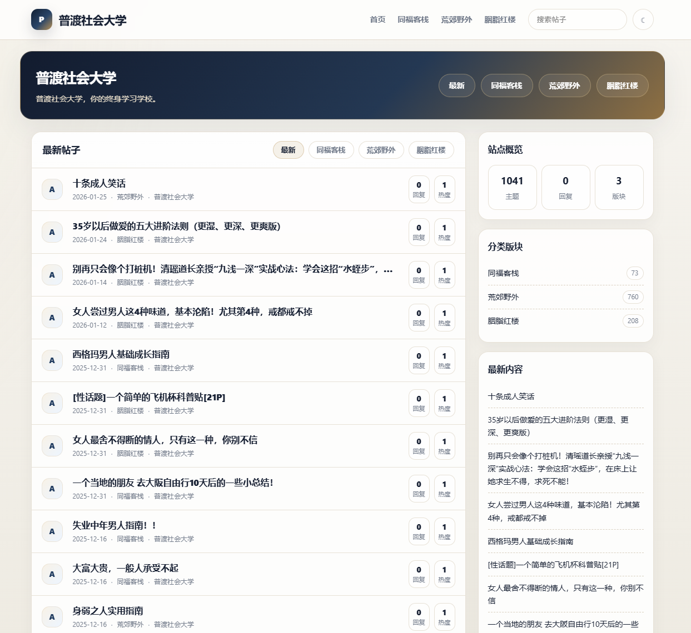

# Pudubi Luxe Pro v8 Responsive

一款简洁优雅的 Typecho 响应式主题，NodeSeek 风格设计。

## 预览

## 特性

- 📱 完美适配移动端 / 平板 / 桌面端
- 🎨 NodeSeek 风格深色头部设计
- 📋 帖子列表、侧边栏统计、分类版块一应俱全
- ⚡ 轻量高效，加载迅速
- 🔧 开箱即用，无需复杂配置

## 安装

1. 下载本主题并解压
2. 将 `pudubi-luxe-pro` 文件夹上传至 Typecho `/usr/themes/` 目录
3.进入 Typecho �后台 → 控制台 → �外观 → **启用**「Pudubi Luxe Pro」

## �文件结构

├── index.php          #  首页模板 
├── post.php           #  文章页模板 
├── page.php           #  独立页面模板 
├── archive.php        #  归档/分类模板 
├── header.php         #  头部模板 
├── footer.php         #  底部模板 
├── sidebar.php        #  侧边栏 
├── comments.php       # �评论模板 
├── functions.php      # �主题函数 
 └── style.css         # �样式表 

##   要求 

-Typecho   1 .2+  
-PHP   7 .4+  

##    License 

MIT License 

##   作者 

Pudubi Luxe Pro by letuyule  

 -GitHub: [github.com/letuyule](https://github.com/letuyule)  
 -Blog: [juewu.net](https://juewu.net)
